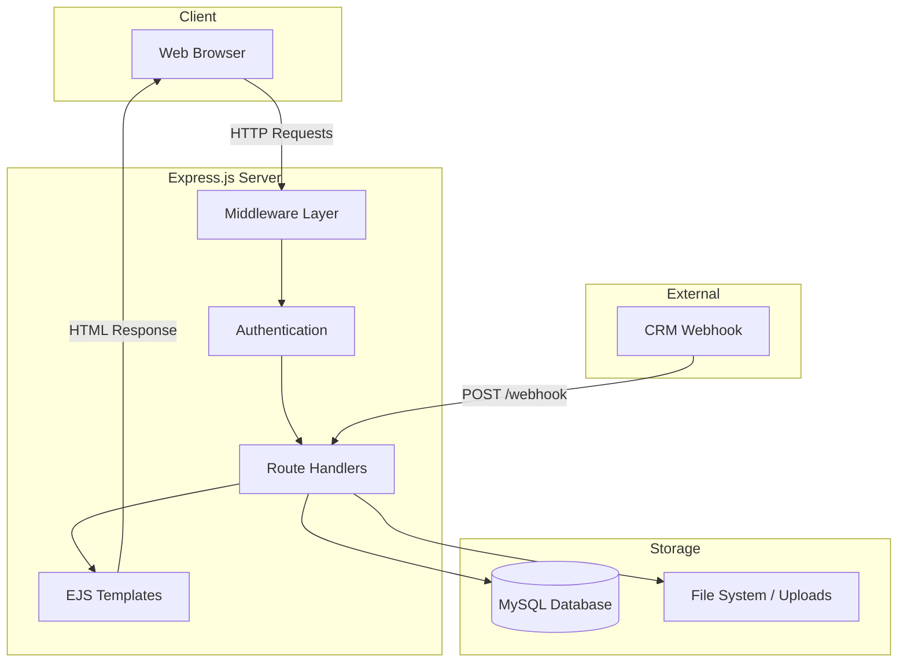
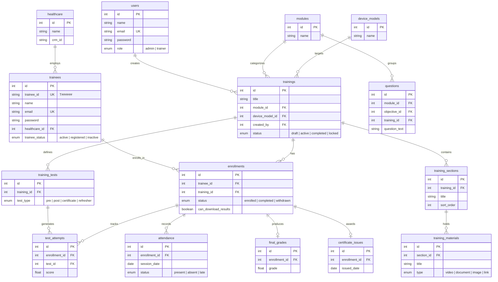
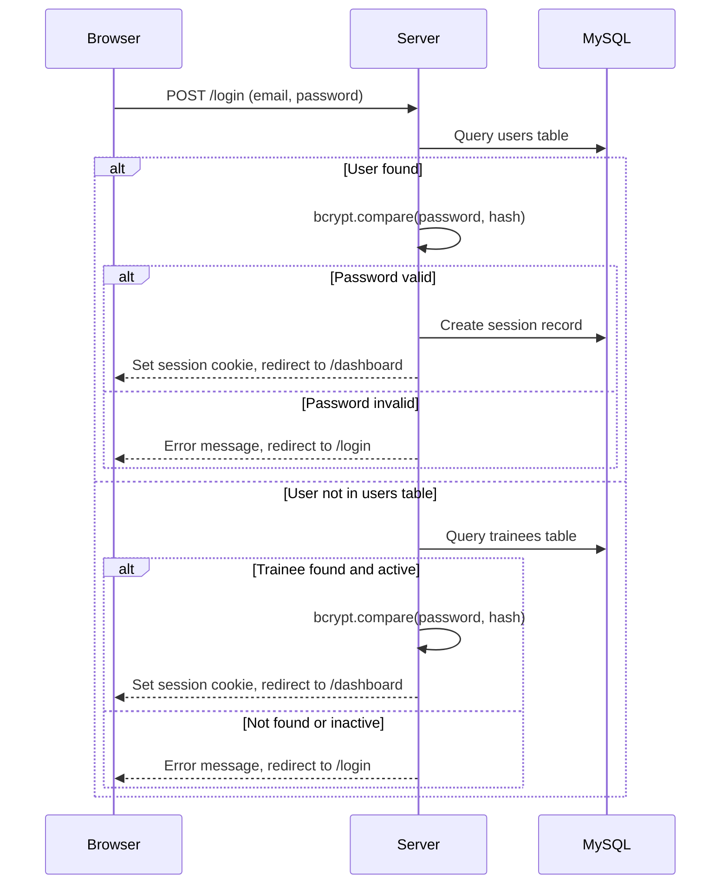
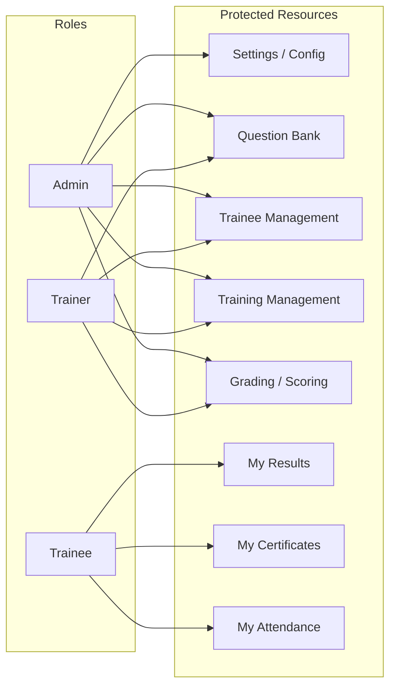
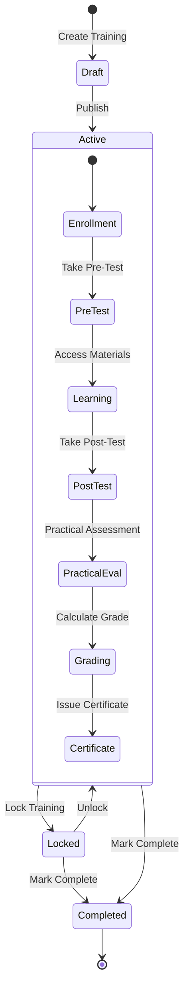
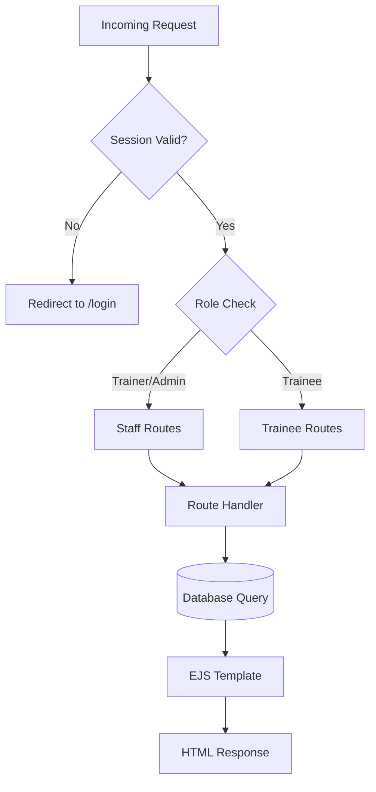
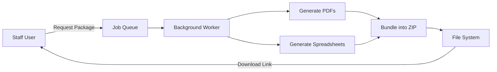
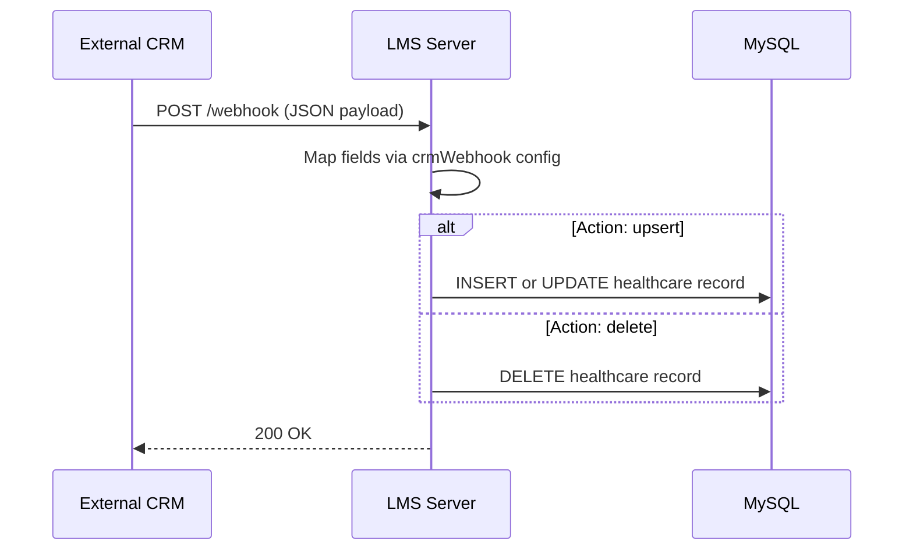

# Quick Stop Solution LMS

A full-featured Learning Management System built for healthcare device training operations. The platform supports trainee self-registration, structured training delivery with multimedia materials, assessments (pre/post/certificate/refresher tests), practical learning outcomes, attendance tracking, grading, certificate issuance, and administrative dashboards.

---

## Table of Contents

- [Tech Stack](#tech-stack)
- [Architecture Overview](#architecture-overview)
- [Database Schema](#database-schema)
- [Authentication Flow](#authentication-flow)
- [Application Modules](#application-modules)
- [Project Structure](#project-structure)
- [Installation](#installation)
- [Configuration](#configuration)
- [Running the Application](#running-the-application)
- [Default Accounts](#default-accounts)

---

## Tech Stack

| Layer | Technology |
|-------|------------|
| Runtime | Node.js |
| Framework | Express.js |
| Template Engine | EJS |
| Database | MySQL (via mysql2) |
| Sessions | express-session + express-mysql-session |
| Authentication | bcrypt (password hashing) |
| File Uploads | Multer |
| Image Processing | Sharp |
| PDF Generation | PDFKit, Puppeteer |
| Spreadsheets | ExcelJS, xlsx |
| Archive | JSZip |
| CSS | Tailwind CSS v4 |
| Validation | express-validator |

---

## Architecture Overview



---

## Database Schema

### Entity Relationship Diagram



### Key Relationships

- A **trainee** belongs to a **healthcare** facility and enrolls in multiple **trainings**
- A **training** contains **sections** with **materials**, and defines **tests** assembled from the **question bank**
- An **enrollment** is the central hub linking a trainee to a training, with child records for attendance, test attempts, scores, grades, and certificates
- **Users** (admin/trainer) manage content, mark attendance, and evaluate practical outcomes

---

## Authentication Flow



### Role-Based Access



---

## Application Modules

### Training Lifecycle



### Request Flow



### Package Generation Flow



---

## Project Structure

```
Quick Stop Solution LMS/
├── server.js                    # Application entry point
├── package.json                 # Dependencies and scripts
├── .env                         # Environment variables (not committed)
├── config/
│   ├── database.js              # MySQL pool, schema init, seeding
│   └── crmWebhook.js           # CRM webhook field mapping
├── routes/
│   ├── auth.js                  # Login, register, logout
│   ├── dashboard.js             # Dashboard views
│   ├── training.js              # Training CRUD, sections, materials
│   ├── trainees.js              # Trainee management, bulk import
│   ├── questionBank.js          # Question bank CRUD
│   ├── test.js                  # Test taking and submission
│   ├── attendance.js            # Attendance tracking
│   ├── results.js               # Results and grade management
│   ├── profile.js               # User profile management
│   ├── settings.js              # System settings
│   ├── trainee.js               # Trainee-specific shortcut routes
│   ├── webhook.js               # CRM webhook endpoint
│   ├── package-generator.js     # PDF/ZIP package generation
│   └── package-job-queue.js     # Background job processing
├── views/
│   ├── layout.ejs               # Base layout template
│   ├── partials/                 # Reusable template fragments
│   ├── auth/                    # Login and registration pages
│   ├── dashboard/               # Dashboard views
│   ├── training/                # Training views, tabs, modals
│   ├── trainees/                # Trainee management views
│   ├── questions/               # Question bank views
│   ├── test/                    # Test-taking interface
│   ├── attendance/              # Attendance views
│   ├── results/                 # Results and grading views
│   ├── profile/                 # Profile views
│   └── settings/                # Settings views
├── public/
│   ├── css/                     # Tailwind input/output stylesheets
│   ├── js/                      # Client-side JavaScript
│   ├── images/                  # Static images and logos
│   └── uploads/                 # User-uploaded content
├── database/
│   ├── schema.sql               # Authoritative database schema
│   └── migrations/              # Incremental schema changes
├── utils/                       # Utility functions
└── scripts/                     # Administrative scripts
```

---

## Installation

### Prerequisites

- Node.js (v18 or later recommended)
- MySQL Server (v8.0 or later)
- npm

### Steps

1. Clone the repository:

```bash
git clone <repository-url>
cd "Quick Stop Solution LMS"
```

2. Install dependencies:

```bash
npm install
```

3. Set up the database. Choose one of these methods:

   **Option A** -- Run the schema manually:

   ```bash
   mysql -u root -p < database/schema.sql
   ```

   **Option B** -- Let the application initialize on startup (set `INIT_DB_ON_STARTUP=true` in your `.env` file).

4. Create a `.env` file in the project root (see [Configuration](#configuration) below).

5. Build Tailwind CSS:

```bash
npm run tw:build
```

---

## Configuration

Create a `.env` file in the project root with the following variables:

```env
# Server
PORT=3000
NODE_ENV=development

# Database
DB_HOST=localhost
DB_USER=root
DB_PASSWORD=your_password

# Session
SESSION_SECRET=your_session_secret
SESSION_COOKIE_NAME=lms.sid
SESSION_MAX_AGE_HOURS=24
SESSION_COOKIE_SECURE=false
SESSION_TABLE=sessions

# Database Bootstrap (set to true on first run, then disable)
INIT_DB_ON_STARTUP=false

# Seed password for default accounts
SEED_PASSWORD=your_seed_password
```

---

## Running the Application

### Development

```bash
npm run dev
```

This starts the server with nodemon for automatic restarts on file changes.

To watch for Tailwind CSS changes in a separate terminal:

```bash
npm run tw:watch
```

### Production

```bash
npm start
```

The application will be available at `http://localhost:3000` (or the port specified in your `.env`).

---

## Default Accounts

When the database is seeded (on first initialization), the following accounts are created:

| Role | Email | Password |
|------|-------|----------|
| Admin | admin@lms.com | Value of `SEED_PASSWORD` env var |
| Trainer | trainer@lms.com | Value of `SEED_PASSWORD` env var |

---

## Route Map

| Path | Auth Required | Role | Description |
|------|---------------|------|-------------|
| `/login` | No | -- | Login page |
| `/register` | No | -- | Trainee self-registration |
| `/dashboard` | Yes | All | Role-specific dashboard |
| `/training` | Yes | All | Training list, view, manage |
| `/trainees` | Yes | Admin, Trainer | Trainee management |
| `/questions` | Yes | Admin, Trainer | Question bank |
| `/tests` | Yes | All | Test taking and results |
| `/attendance` | Yes | All | Attendance tracking |
| `/results` | Yes | All | Results and grades |
| `/profile` | Yes | All | Profile management |
| `/settings` | Yes | Admin, Trainer | System configuration |
| `/webhook` | No | -- | CRM integration endpoint |

---

## CRM Integration

The system accepts webhook payloads from an external CRM to synchronize healthcare facility data. The webhook endpoint at `POST /webhook` supports upsert and delete operations on the healthcare records table, mapped through the configuration in `config/crmWebhook.js`.


